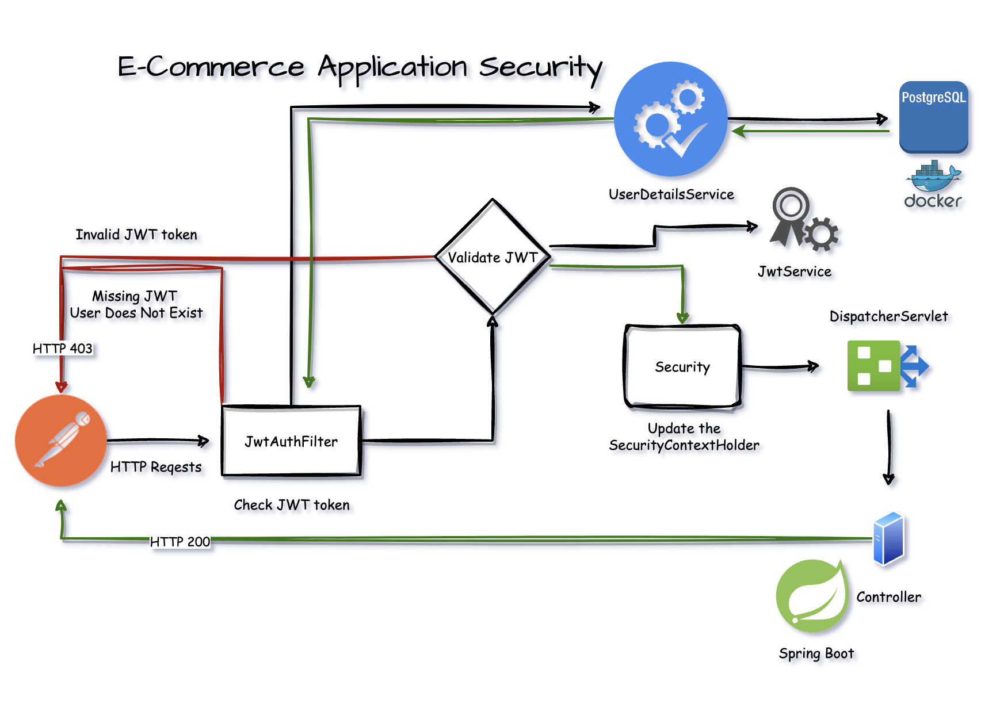
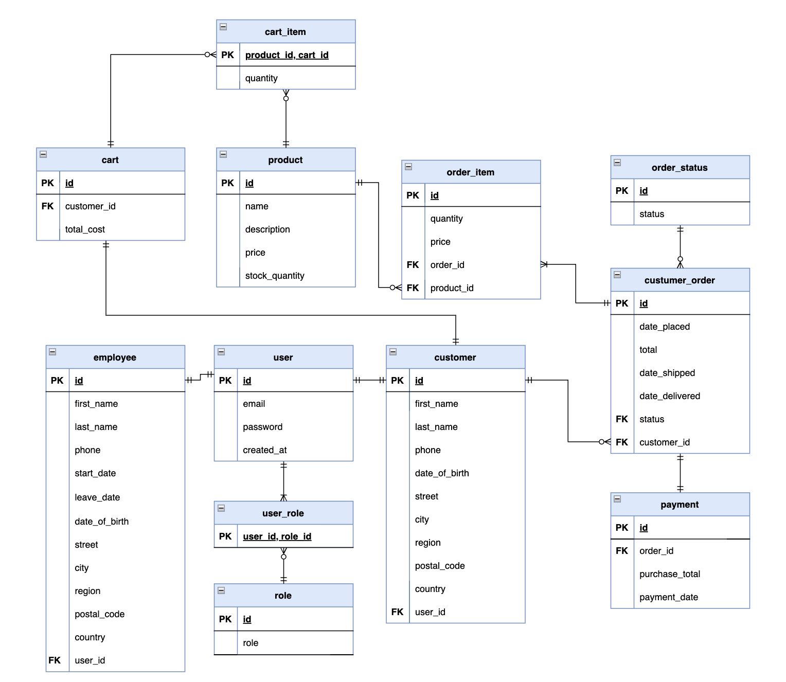

# Online E-commerce Store

## Description
Developed fully tested N-tier layered e-commerce store backend using Java, Spring Boot, 
Spring Data JPA, Spring Security, Stripe Payments, and PostgresSQL.

- Stripe payments API is used to handle customer order payments.
- Spring security is used to manage authentication and authorization based on user role.
- Custom exception handling is implemented to control error responses.
- Data Transfer Objects(DTOs) are used to transfer data between different application layers.

## System Requirements
- Customers can browser products, add items to shopping cart, place orders, track orders, and make purchases.
- Users with employee role are allowed to create, update, and remove products from the system.
- Allow registration and authentication of users with different roles such as CUSTOMER and EMPLOYEE.
- Protect application with authentication and authorization based on user role.

## Application Security Diagram



## Database ER Diagram


## Local Project Setup

### Mandatory Requirements
* Java 17
```
❯ java --version
openjdk 17.0.5 2022-10-18
OpenJDK Runtime Environment Temurin-17.0.5+8 (build 17.0.5+8)
OpenJDK 64-Bit Server VM Temurin-17.0.5+8 (build 17.0.5+8, mixed mode)
```
* Docker Engine and Docker Compose
```
❯ docker version
Client:
 Cloud integration: v1.0.29
 Version:           20.10.21
 API version:       1.41
 Go version:        go1.18.7
 Git commit:        baeda1f
 Built:             Tue Oct 25 18:01:18 2022
 OS/Arch:           darwin/arm64
 Context:           default
 Experimental:      true

Server: Docker Desktop 4.15.0 (93002)
 Engine:
  Version:          20.10.21
  API version:      1.41 (minimum version 1.12)
  Go version:       go1.18.7
  Git commit:       3056208
  Built:            Tue Oct 25 17:59:41 2022
  OS/Arch:          linux/arm64
  Experimental:     false
 containerd:
  Version:          1.6.10
  GitCommit:        770bd0108c32f3fb5c73ae1264f7e503fe7b2661
 runc:
  Version:          1.1.4
  GitCommit:        v1.1.4-0-g5fd4c4d
 docker-init:
  Version:          0.19.0
  GitCommit:        de40ad0
```

### Optional Requirements:
* Maven >= 3.8 (the project includes the Maven Wrapper to run the project)
```
❯ mvn --version
Apache Maven 3.8.7 (b89d5959fcde851dcb1c8946a785a163f14e1e29)
Maven home: /opt/homebrew/Cellar/maven/3.8.7/libexec
Java version: 17.0.5, vendor: Eclipse Adoptium, runtime: /Library/Java/JavaVirtualMachines/temurin-17.jdk/Contents/Home
Default locale: en_US, platform encoding: UTF-8
OS name: "mac os x", version: "13.1", arch: "aarch64", family: "mac"
```
### Running the Project Locally
1. Make sure Docker is running
2. Start required infrastructure to run application with`docker-compose up`
3. Run the application with `./mvnw spring-boot:run`
4. Access http://localhost:8080 for the application frontend
5. (Optional) access http://localhost:8080/swagger-ui/index.html for Swagger API documentation UI


